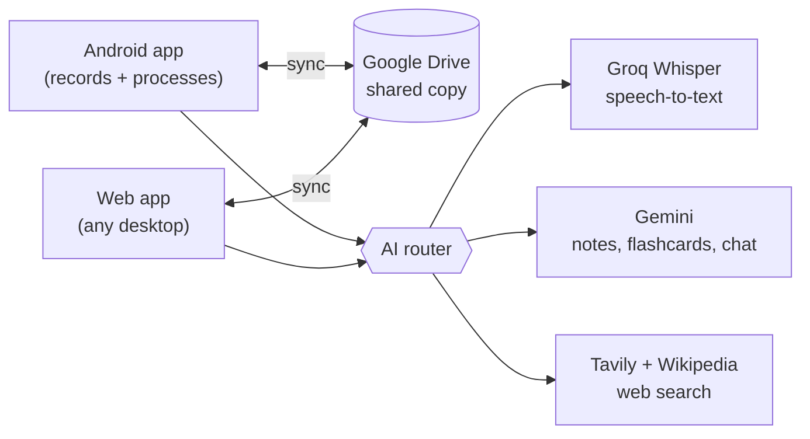

# Notes App

A personal study app for university. My Android phone records every class, names and files each recording from my timetable, and turns it into English transcripts, notes, flashcards and practice questions. A study chat can search my lectures and the web. Everything syncs through Google Drive, and a web app gives me full access from any computer. It runs entirely on free services.

> **Status: planning.** There is no app code yet. The full requirements and design are in [docs/specs/2026-09-18-notes-app-design.md](docs/specs/2026-09-18-notes-app-design.md).

## The problem

Lectures here mix English, Urdu and Pashto, often in noisy rooms, and I read English best. In class it's hard to listen, write and understand at once, and recordings I never go back to don't help. This app keeps each lecture's audio, board photos, transcript and notes together, in English, and turns them into revision material automatically.

## Features

### Recording (Android)
- One tap to record. The app already knows which class it is from the timetable.
- Keeps recording with the screen off, in a pocket, and after the app is swiped away
- Saves audio every 30 seconds, so a crash or dead battery loses seconds, not the lecture
- Photos of the board or slides, and bookmarks, pinned to the moment they were taken
- Automatic names: `Mon 21 Sep 2026 – Fundamentals of Accounting – Lecture 5`, with lectures and labs numbered separately, following the timetable

### Automatic processing
- Transcript in the original language plus an English translation, lined up by timestamp
- English summary, key concepts and study notes as Markdown (`.md`) files
- Tap any line of the transcript to hear that moment

### Studying
- **Flashcards** scheduled with FSRS (Anki's modern algorithm), with two buttons: *Forgot* / *Remembered*
- **Practice questions**: mixed across lectures, exam-style multiple choice and numerical questions, and "explain it in your own words" with AI feedback
- **Exam mode** and a one-page **revision sheet** per subject
- **Study chat** per subject: answers from my lectures (with timestamps), and from the web and Wikipedia (with links)

### Desktop
- A web app, free on GitHub Pages. Sign in with Google to browse, play, edit, study and chat from any computer.
- Everything syncs both ways through my own Google Drive
- An auto-updated **Class share** folder in Drive for classmates: notes, transcripts, revision sheets and practice questions as Google Docs, plus flashcards for Anki or Quizlet. Never audio.

## How it works

There's no server of my own. API keys are entered once on each device and stored only there, never in this repo.

## Bring your own API keys

This repo and app ship with **no API keys**. Everyone who uses the code adds their own free keys locally:

| Service | Used for | Get a free key |
| --- | --- | --- |
| Groq | Speech-to-text (Whisper) | https://console.groq.com/keys |
| Google Gemini | Notes, flashcards, study chat | https://aistudio.google.com/apikey |
| Tavily | Web search in the study chat | https://app.tavily.com |

- **In the app:** paste them into Settings on each device (phone and browser). They're stored only on that device and sent only to their own provider.
- **For development scripts:** copy [`.env.example`](.env.example) to `.env` and fill it in. `.env` is git-ignored, so never commit it.

## Tech stack

| Layer | Choice |
| --- | --- |
| App | [Expo](https://expo.dev) (React Native + TypeScript), one codebase for Android and web |
| Recorder | Custom Kotlin module: a foreground service that saves audio in chunks |
| Local data | SQLite on Android, IndexedDB in the browser |
| Sync and storage | Google Drive API |
| Speech-to-text | Groq Whisper (free tier) |
| AI | Google Gemini API (free tier) |
| Web search | Tavily (free tier) + Wikipedia |
| Flashcards | [ts-fsrs](https://github.com/open-spaced-repetition/ts-fsrs) |
| Web hosting | GitHub Pages |

## Roadmap

- [x] Requirements and design
- [ ] **Phase 0**: test free transcription on real lectures (English/Urdu/Pashto, noisy rooms) and confirm the free-tier limits
- [ ] **Phase 1**: Android recorder, timetable, automatic naming and numbering
- [ ] **Phase 2**: transcripts, English translation, summaries and Markdown notes
- [ ] **Phase 3**: Google Drive sync and the desktop web app
- [ ] **Phase 4**: flashcards, practice questions, exam mode, revision sheets
- [ ] **Phase 5**: study chat with web search

## Privacy and recording consent

- **Ask before recording.** Check the university's policy and ask each lecturer.
- Recordings are for personal study only. Share transcripts with classmates only if the lecturer is fine with it.
- Audio is sent to Groq and text and photos to Google Gemini for processing. On free tiers, providers may use this content to improve their services.
- API keys live only on my devices. Never commit them. `.env` files are git-ignored.

## License

No license has been chosen yet. Until one is added, all rights are reserved by default.
