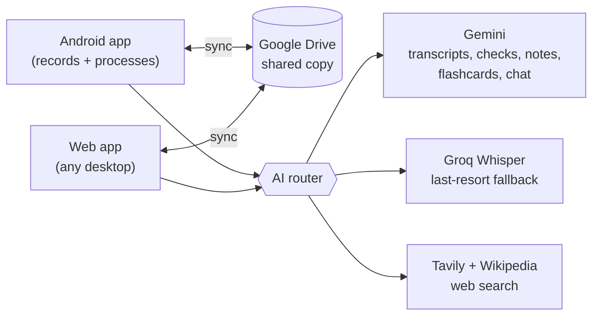

# Notes App

A personal study app for university. My Android phone records every class, names and files each recording from my timetable, and turns it into English transcripts, notes, flashcards and practice questions. A study chat can search my lectures and the web. Everything syncs through Google Drive, and a web app gives me full access from any computer. It runs entirely on free services.

> **Status:** design approved, transcription tested (Phase 0). Next: **Milestone 1**, the timetable logic ([plan](docs/superpowers/plans/2026-09-18-m1-domain-core.md)). No app code yet.

## The problem

Lectures here mix English, Urdu and Pashto, often in noisy rooms, and I read English best. In class it's hard to listen, write and understand at once, and recordings I never go back to don't help. This app keeps each lecture's audio, board photos, transcript and notes together, in English, and turns them into revision material automatically.

## Features

### Recording (Android)
- One tap to record. The app already knows which class it is from the timetable.
- Keeps recording with the screen off, in a pocket, and after the app is swiped away
- Saves audio every 30 seconds, so a crash or dead battery loses seconds, not the lecture
- Photos of the board or slides, and bookmarks, pinned to the moment they were taken
- Automatic names: `Mon 21 Sep 2026 – Fundamentals of Accounting – Lecture 5`, with lectures and labs numbered separately, following the timetable

### Automatic processing
- Gemini listens to the audio and writes the transcript plus an English translation in one pass
- A **caution loop** checks every transcript: automatic checks, then a stronger AI model listens again and corrects mistakes. Anything it can't fix is shown to me instead of guessed, and my corrections are remembered for future lectures
- Transcript in Roman Urdu as spoken (like the Gemini website writes it), with English under each line and who's speaking
- English summary, key concepts and study notes as Markdown (`.md`) files
- Tap any line of the transcript to hear that moment

### Studying
- **Flashcards** scheduled with FSRS (Anki's modern algorithm), with two buttons: *Forgot* / *Remembered*
- **Practice questions**: mixed across lectures, exam-style multiple choice and numerical questions, and "explain it in your own words" with AI feedback
- **Exam mode** and a one-page **revision sheet** per subject
- **Study chat** per subject: answers from my lectures (with timestamps), and from the web and Wikipedia (with links)

### Desktop
- A web app, free on GitHub Pages. Sign in with Google to browse, play, edit, study and chat from any computer.
- Everything syncs both ways through my own Google Drive
- An auto-updated **Class share** folder in Drive for classmates: notes, transcripts, revision sheets and practice questions as Google Docs, plus flashcards for Anki or Quizlet. Never audio.

## How it works

There's no server of my own. API keys are entered once on each device and stored only there, never in this repo.

## Bring your own API keys

This repo and app ship with **no API keys**. Everyone who uses the code adds their own free keys locally:

| Service | Used for | Get a free key |
| --- | --- | --- |
| Google Gemini | Transcripts, checks, notes, flashcards, study chat | https://aistudio.google.com/apikey |
| Groq | Backup speech-to-text (Whisper) | https://console.groq.com/keys |
| Tavily | Web search in the study chat | https://app.tavily.com |

- **In the app:** paste them into Settings on each device (phone and browser). They're stored only on that device and sent only to their own provider.
- **For development scripts:** copy [`.env.example`](.env.example) to `.env` and fill it in. `.env` is git-ignored, so never commit it.

## Tech stack

| Layer | Choice |
| --- | --- |
| App | [Expo](https://expo.dev) (React Native + TypeScript), one codebase for Android and web |
| Recorder | Custom Kotlin module: a foreground service that saves audio in chunks |
| Local data | SQLite on Android, IndexedDB in the browser |
| Sync and storage | Google Drive API |
| Transcription + AI | Google Gemini API (free tier): Flash transcribes whole lectures; Flash-Lite double-checks doubtful parts and writes notes and flashcards; Gemma 4 as backup |
| Backup speech-to-text | Groq Whisper (free tier) |
| Web search | Google Search through Gemini, Tavily (free tier), Wikipedia |
| Flashcards | [ts-fsrs](https://github.com/open-spaced-repetition/ts-fsrs) |
| Web hosting | GitHub Pages |

## Roadmap

| Milestone | What you get | Status |
| --- | --- | --- |
| M0 | Requirements, design, transcription test | ✅ Done |
| M1 | Timetable logic: class detection, numbering, naming (tested, with CI) | Ready to build |
| M2 | Android recorder that can't lose a lecture | Planned |
| M3 | Android app used in class every day (no AI yet) | Planned |
| M4 | Every lecture becomes a checked transcript and notes | Planned |
| M5 | Everything on the desktop; classmates' shared folder | Planned |
| M6 | Flashcards, practice questions, exam mode | Planned |
| M7 | Study chat with web search | Planned |

Details, exit criteria and requirement traceability: [docs/roadmap.md](docs/roadmap.md).

## Documentation

| Document | What it is |
| --- | --- |
| [Design](docs/specs/2026-09-18-notes-app-design.md) | Requirements (numbered, e.g. R-REC-1) and architecture |
| [Decisions (ADRs)](docs/adr/README.md) | Why each major choice was made, and what was rejected |
| [Roadmap](docs/roadmap.md) | Milestones, spikes, traceability, risk register |
| [M1 plan](docs/superpowers/plans/2026-09-18-m1-domain-core.md) | Step-by-step, test-first build plan for the next milestone |
| [Engineering conventions](docs/engineering.md) | Branches, commits, Definition of Done, tests, privacy checks |
| [Phase 0 findings](docs/phase0-findings.md) | Transcription test results on real lectures |
| [Project log](docs/project-log.md) | Dated record of what happened and why |
| [Spike tools](tools/spikes/README.md) | The scripts behind the tests, and `verify_plan.py` to re-check a plan's code |

## Privacy and recording consent

- **Ask before recording.** Check the university's policy and ask each lecturer.
- Recordings are for personal study only. Share transcripts with classmates only if the lecturer is fine with it.
- Audio, text and photos are sent to Google Gemini (and audio to Groq as a backup) for processing. On free tiers, providers may use this content to improve their services.
- API keys live only on my devices. Never commit them. `.env` files are git-ignored.

## License

No license has been chosen yet. Until one is added, all rights are reserved by default.
