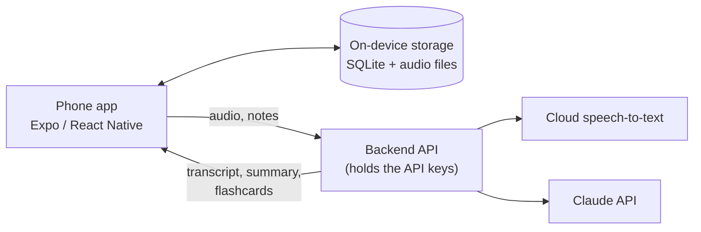

# Notes App

A notes app for iOS and Android built for university study. Take notes by course, record lectures, get timestamped transcripts, and use AI to turn a class into study notes, flashcards and practice questions.

> **Status: planning.** There is no app code yet. This README is the plan for what gets built.

## The problem

In a lecture you're trying to listen, write and understand at the same time, and something always gets missed. Afterwards the audio (if you recorded it) sits in a folder you never open, and your notes don't match what was actually said. This app keeps notes, recordings and transcripts together per lecture, and uses AI to help you revise from them.

## Features

### Notes
- Organised by **semester → course → lecture**
- Rich text notes, with photos of slides or the whiteboard
- Full-text search across all notes and transcripts
- Works offline: everything is saved on the phone first

### Lecture recording
- One-tap recording that keeps going with the screen locked or the app in the background
- **Bookmarks** during the lecture (e.g. "this is on the exam") saved as timestamps
- Notes typed while recording are tied to the moment you wrote them, so tapping a note jumps to that point in the audio
- Playback at variable speed

### Transcription
- After class, the recording is sent to a cloud speech-to-text service and comes back as a timestamped transcript
- If there's no signal in the lecture hall, the upload waits in a queue and goes when you're back online
- Tap any line of the transcript to play that moment

### AI study tools (Claude)
- **Summary** of each lecture with the key concepts
- **Clean notes**: merge your rough notes with the transcript into one tidy set of notes
- **Flashcards and practice questions** generated from a lecture or a whole course
- **Ask your lectures**: "what did the lecturer say about entropy?" answered from your own transcripts, with a link to the lecture and timestamp
- **Revision sheet** per course before exams

## How it works



The app never talks to the AI or transcription services directly. Anything inside an app binary can be extracted, so API keys live only on a small backend, which the app calls instead.

## Tech stack

| Layer | Choice | Notes |
| --- | --- | --- |
| Mobile app | [Expo](https://expo.dev) (React Native) + TypeScript | One codebase for iOS and Android |
| Navigation | Expo Router | File-based routes |
| Audio | `expo-audio` | Background recording needs iOS background-audio config and an Android foreground service, so it requires a development build, not Expo Go |
| Local data | `expo-sqlite`, `expo-file-system` | Courses, notes and transcripts in SQLite; audio as files |
| Backend | Small TypeScript API (serverless) | Keeps keys secret, calls transcription and Claude |
| Speech-to-text | Cloud provider, **not chosen yet** | See open questions |
| AI | [Claude API](https://docs.anthropic.com) via `@anthropic-ai/sdk`, model `claude-opus-5` | Summaries, flashcards, Q&A over transcripts |

## Privacy and recording consent

- **Ask before recording.** Many universities have rules about recording lectures, and some lecturers don't allow it. Check your university's policy and ask the lecturer.
- Recordings are for your own study. Don't share them.
- Audio is sent to a third-party speech-to-text service, and transcripts and notes are sent to the Claude API for the AI features. The app should say this clearly and let you delete any recording or transcript.
- API keys go in the backend's `.env` file, which is git-ignored. Never commit them.

## Roadmap

- [x] Plan the app (this README)
- [ ] **MVP**: scaffold the Expo app; courses and notes stored in SQLite; record and play back lectures; bookmarks
- [ ] **Transcription**: backend API, cloud speech-to-text, timestamped transcript view, offline upload queue
- [ ] **AI**: lecture summaries, clean notes, flashcards, practice questions
- [ ] **Ask your lectures**: questions answered across a whole course with timestamp links
- [ ] **Later**: accounts, cloud sync and backup, export to PDF / Markdown

## Open questions

- **Which speech-to-text provider?** Compare accuracy on accents and technical vocabulary, price per hour of audio, word-level timestamps, and file size limits for 1–2 hour lectures.
- **Where to host the backend?** Any serverless platform works; pick one with a free tier for development.
- **Cost per lecture.** Transcription is priced per audio minute and AI per token. Estimate the cost of a typical 90-minute lecture before adding more AI features.
- **Sync.** Local-only is enough to start; decide later whether accounts and cloud backup are worth the extra work.

## Planned layout

```
notes-app/
├── mobile/     # Expo app (screens, components, local database)
├── server/     # Backend API: transcription and Claude calls
└── README.md
```

## Getting started

Nothing to run yet. Setup steps will go here once the app is scaffolded. You'll need:

- [Node.js](https://nodejs.org) (LTS)
- An Android phone or emulator (Android Studio) for testing
- For iOS: a Mac with Xcode, or Expo's cloud builds (EAS Build) if you're on Windows

## License

No license has been chosen yet. Until one is added, all rights are reserved by default.
